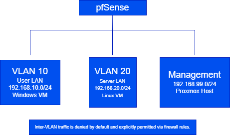
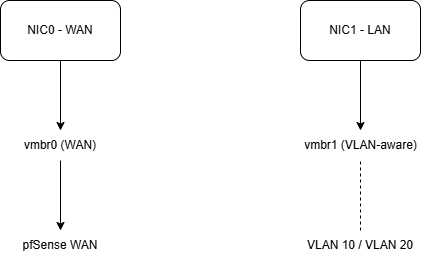

# Cybersecurity & Networking Homelab

> **TL;DR:** Virtualized homelab simulating small-enterprise networking and security using Proxmox, pfSense, Pi-hole, and Tailscale. Focused on firewall policy design, DNS enforcement, zero-trust remote access, and real-world troubleshooting.

---

## Overview
This repository documents a personal cybersecurity homelab built to simulate a **small enterprise network environment**. The project focuses on **network security fundamentals**, including firewall configuration, DNS-based threat mitigation, secure remote access, and virtualization.

Rather than exposing services to the public internet, the lab emphasizes a **defensive, least-privilege design** with centralized control, visibility, and documentation. The environment is continuously iterated on as a learning platform for hands-on cybersecurity and system administration practice.

---

## Objectives
- Design and operate a stateful firewall and router using pfSense
- Virtualize network infrastructure using Proxmox VE
- Enforce network-wide DNS filtering and visibility with Pi-hole
- Enable secure remote access using a zero-trust VPN model
- Practice real-world troubleshooting across Layers 2–4
- Document architecture, decisions, and lessons learned professionally

---

## Technologies Used
- **Proxmox VE** – Virtualization platform hosting firewall and service VMs  
- **pfSense** – Firewall, routing, NAT, and DHCP  
- **Pi-hole** – Network-wide DNS filtering and query logging  
- **Tailscale** – Zero-trust remote access VPN (WireGuard-based)  
- **Linux VMs** – Server and infrastructure services  
- **Netgear RAX9** – Wireless access point (AP mode)

---

## Network Architecture
- Dedicated **WAN and LAN interfaces** routed through pfSense  
- pfSense virtualized inside Proxmox using bridged interfaces  
- Centralized DHCP and DNS control via pfSense and Pi-hole  
- Wireless access point operating in **AP mode**, not router mode  
- Secure remote access via Tailscale with **no inbound WAN ports exposed**

### High-Level Architecture

### Logical Network Layout

### Proxmox Virtualization & Bridging

---

## Key Features & Skills Demonstrated
- Stateful firewall rule creation and validation
- NAT and interface assignment in pfSense
- DHCP and DNS enforcement across the network
- Secure remote access using a zero-trust VPN model
- Virtual machine networking and bridge configuration
- Troubleshooting DHCP, routing, DNS, and authentication issues
- Understanding consumer AP behavior in enterprise-style designs
- Clear technical documentation and change tracking

---

## Troubleshooting Scenarios Practiced
- Clients receiving APIPA addresses due to bridge misconfiguration
- DNS resolution failures traced to upstream routing issues
- Firewall rules unintentionally blocking internal services
- Proxmox authentication failures caused by realm mismatch
- Wireless connectivity issues caused by incorrect AP wiring
- VPN access failures related to NAT and service exposure

---

## Security Focus
This lab emphasizes **defensive security principles**, including:
- Default-deny firewall posture
- Minimizing attack surface by avoiding WAN-exposed services
- Network-wide DNS enforcement and visibility
- Zero-trust remote access using identity-based VPN
- Separation of management and user access paths

---

## Documentation & Evidence
- **Firewall rules:** [firewall/firewall-rules.md](firewall/firewall-rules.md)
- **Network configuration:** [networking/network-config.md](networking/network-config.md)
- **Remote access design:** [remote-access.md](remote-access.md)
- **Troubleshooting lessons:** [troubleshooting/lessons-learned.md](troubleshooting/lessons-learned.md)
- **Security+ mapping:** [securityplus-mapping.md](securityplus-mapping.md)
- **Roadmap:** [roadmap.md](roadmap.md)
- **Implementation Notes:** [implementation_notes.md](implementation_notes.md) 

---

## Future Enhancements
- VLAN segmentation (Trusted / Servers / IoT / Guest)
- IDS/IPS integration (Suricata)
- Centralized logging and monitoring
- SIEM-style alerting and correlation
- Configuration backups and versioning

---

## Purpose
This homelab is maintained to support career development in **Cybersecurity, SOC Analysis, and System Administration**. It complements formal coursework and certifications by providing hands-on experience with real infrastructure, real failures, and real fixes.

---

## Author
**Harrison Bourg**  
Cybersecurity Graduate  
GitHub: https://github.com/hpbourg

