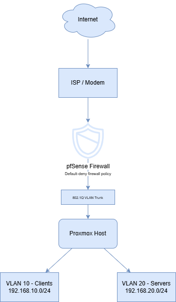
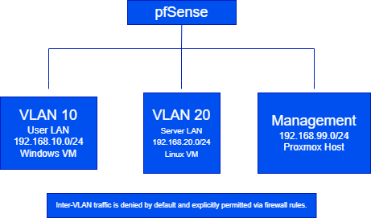
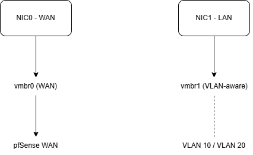

# Cybersecurity & Networking Homelab

> ⚡ Actively maintained — last updated March 2026

> **TL;DR:** Virtualized homelab simulating small-enterprise networking and security using Proxmox, pfSense, Suricata, Pi-hole, Tailscale, and Plex. Focused on firewall policy design, VLAN segmentation, intrusion detection, DNS enforcement, zero-trust remote access, storage redundancy, and real-world troubleshooting.

---

## Overview
This repository documents a personal cybersecurity homelab built to simulate a **small enterprise network environment**. The project focuses on **network security fundamentals**, including firewall configuration, VLAN segmentation, intrusion detection, DNS-based threat mitigation, secure remote access, and virtualization.

Rather than exposing services to the public internet, the lab emphasizes a **defensive, least-privilege design** with centralized control, visibility, and documentation. The environment is continuously iterated on as a learning platform for hands-on cybersecurity and system administration practice.

---

## Objectives
- Design and operate a stateful firewall and router using pfSense
- Virtualize network infrastructure using Proxmox VE
- Enforce network-wide DNS filtering and visibility with Pi-hole
- Enable secure remote access using a zero-trust VPN model
- Implement VLAN segmentation to isolate network traffic by function
- Deploy and tune a network intrusion detection system (Suricata)
- Deploy and manage self-hosted media services (Plex) in a segmented environment
- Configure storage redundancy using ZFS mirroring
- Practice real-world troubleshooting across Layers 2–4
- Document architecture, decisions, and lessons learned professionally

---

## Technologies Used
- **Proxmox VE** – Virtualization platform hosting firewall, service VMs, and LXC containers
- **pfSense** – Firewall, routing, NAT, DHCP, and VLAN management
- **Suricata** – Network intrusion detection system (IDS) monitoring WAN and LAN interfaces
- **Pi-hole** – Network-wide DNS filtering and query logging
- **Tailscale** – Zero-trust remote access VPN (WireGuard-based) with subnet routing
- **Plex Media Server** – Self-hosted media streaming deployed as an LXC container
- **ZFS** – Storage redundancy via mirrored 1TB drives
- **Linux LXC Containers** – Lightweight containerized service deployment
- **Netgear RAX9** – Wireless access point (AP mode)

---

## Network Architecture
- Dedicated **WAN and LAN interfaces** routed through pfSense
- pfSense virtualized inside Proxmox using bridged interfaces
- **VLAN segmentation** isolating User, Server, and Management traffic
- Centralized DHCP and DNS control via pfSense and Pi-hole
- Wireless access point operating in **AP mode**, not router mode
- Secure remote access via Tailscale with **no inbound WAN ports exposed**
- Tailscale **subnet routing** advertising internal VLANs for full remote access

### High-Level Architecture

### Logical Network Layout

### Proxmox Virtualization & Bridging

---

## Storage Architecture

| Pool | Type | Drives | Usage |
|------|------|--------|-------|
| `media-mirro` | ZFS Mirror | 2x 1TB HDD (ST1000DM003) | Plex config, metadata, databases |
| `media-storage` | Directory (ext4) | 1x 4TB HDD (WD40EMRX) | Media library (movies, TV shows) |
| `local-lvm` | LVM | 525GB SSD (Crucial CT525MX300) | Proxmox OS, VMs, LXC containers |

ZFS mirroring provides drive-failure redundancy with automatic checksumming and snapshot support. Media files are stored separately on the 4TB drive, keeping replaceable content separate from critical configuration data.

---

## Services Deployed

### Suricata IDS (pfSense Package)
- Network intrusion detection running directly on pfSense
- Monitoring both **WAN** and **LAN** interfaces
- Rulesets enabled: ETOpen Emerging Threats, Snort GPLv2 Community Rules, Feodo Tracker Botnet C2, ABUSE.ch SSL Blacklist
- Rules updated automatically every 12 hours
- Running in IDS mode (detect only) for alert tuning before enabling blocking
- First alert investigated and tuned: DHCP truncated options false positive from ISP gateway suppressed

### Plex Media Server (LXC Container)
- **IP:** 192.168.20.54 (static, VLAN 20)
- **Storage:** Config on ZFS mirror, media library on 4TB drive at `/mnt/media`
- **Remote Access:** Accessible via Tailscale subnet routing, no WAN ports exposed
- **Libraries:** Movies (`/mnt/media/movies`), TV Shows (`/mnt/media/shows`)

### Pi-hole (VM)
- Network-wide DNS filtering and ad blocking
- DNS queries routed through Pi-hole for all VLANs
- Accessible remotely via Tailscale with DNS override enabled in Tailscale admin panel

---

## Key Features & Skills Demonstrated
- Stateful firewall rule creation and validation
- VLAN design and inter-VLAN traffic enforcement
- NAT and interface assignment in pfSense
- DHCP and DNS enforcement across the network
- Network intrusion detection deployment and alert tuning (Suricata)
- False positive identification and suppression
- ZFS storage configuration and redundancy planning
- LXC container deployment and network configuration
- Secure remote access using a zero-trust VPN model
- Tailscale subnet routing for full remote network access
- Virtual machine networking and bridge configuration
- Troubleshooting DHCP, routing, DNS, and authentication issues
- Understanding consumer AP behavior in enterprise-style designs
- Clear technical documentation and change tracking

---

## Troubleshooting Scenarios Practiced
- Clients receiving APIPA addresses due to bridge misconfiguration
- DNS resolution failures traced to upstream routing issues
- Firewall rules unintentionally blocking internal services
- Proxmox authentication failures caused by realm mismatch
- Wireless connectivity issues caused by incorrect AP wiring
- VPN access failures related to NAT and service exposure
- **LXC VLAN connectivity failure caused by Proxmox firewall bridge (fwbr) dropping tagged frames**
- **pfSense VLAN interface misconfiguration (upstream gateway set incorrectly on LAN-side interface)**
- **Tailscale daemon failing in LXC due to missing TUN device**
- **Suricata false positive tuning — DHCP truncated options alert from ISP gateway suppressed**

---

## Security Focus
This lab emphasizes **defensive security principles**, including:
- Default-deny firewall posture
- VLAN segmentation to limit lateral movement between network zones
- Minimizing attack surface by avoiding WAN-exposed services
- Network-wide DNS enforcement and visibility
- Intrusion detection across WAN and LAN with multi-ruleset coverage
- Zero-trust remote access using identity-based VPN
- Separation of management and user access paths
- pfSense as sole firewall enforcement point for VLAN-segmented containers

---

## Documentation & Evidence
- **Firewall rules:** [firewall-rules.md](firewall-rules.md)
- **Network configuration:** [network-config.md](network-config.md)
- **Security+ mapping:** [securityplus-mapping.md](securityplus-mapping.md)
- **Roadmap:** [roadmap.md](roadmap.md)
- **Implementation Notes:** [implementation_notes.md](implementation_notes.md)
- **Scenarios:** [scenarios/](scenarios/)

---

## Future Enhancements
- Centralized logging and SIEM (Wazuh)
- Vulnerable VM lab for attack/detect practice (Metasploitable, DVWA)
- Honeypot deployment (OpenCanary)
- Automated configuration backups to GitHub
- Additional VLAN segments (IoT, Guest)
- Promote Suricata to IPS mode after alert tuning is complete

---

## Purpose
This homelab is maintained to support career development in **Cybersecurity, SOC Analysis, and System Administration**. It complements formal coursework and certifications by providing hands-on experience with real infrastructure, real failures, and real fixes.

---

## Author
**Harrison Bourg**
Cybersecurity Graduate
GitHub: https://github.com/hpbourg
